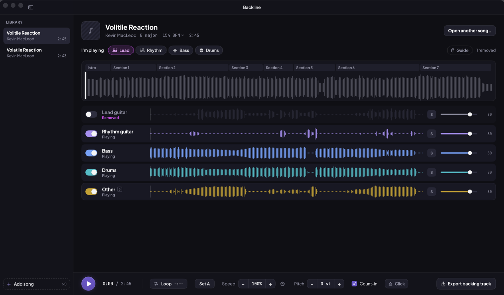
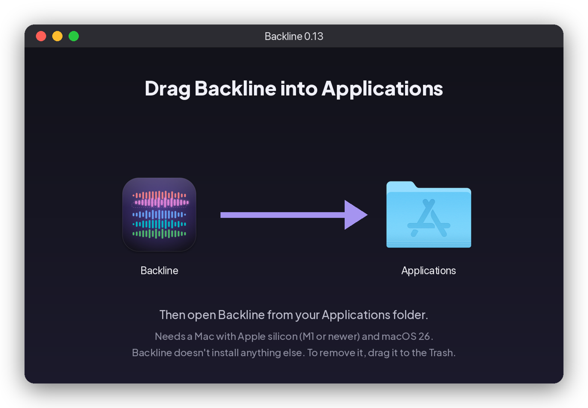
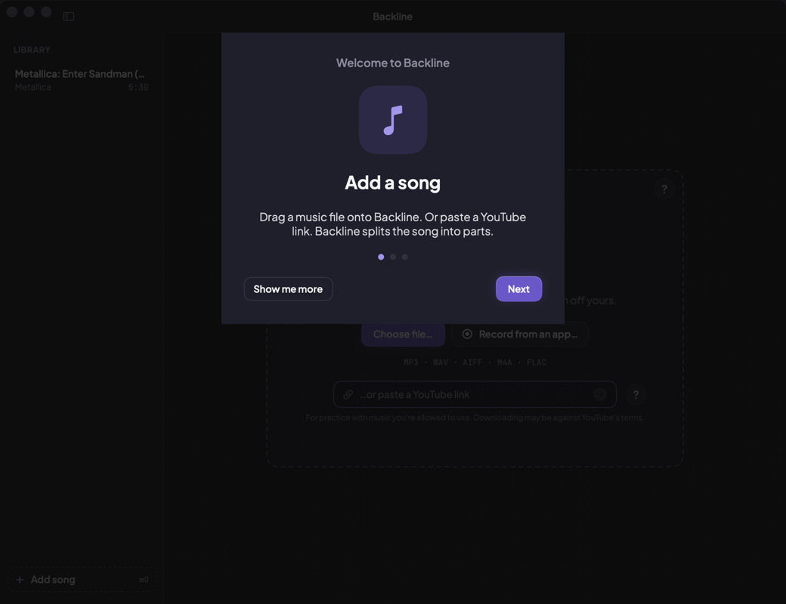
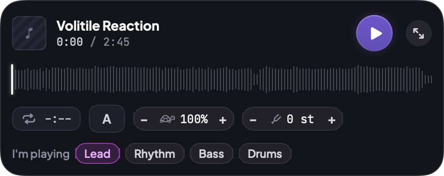
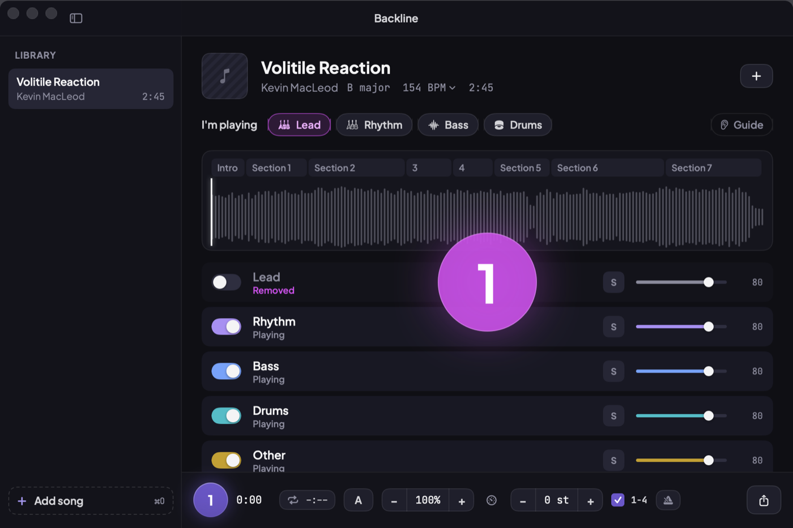

# Backline

## [⬇ Download Backline for Mac](https://github.com/alexpizarro/backline/releases/latest/download/Backline.dmg)

Free. For Macs with Apple silicon (M1 or newer) on macOS 26. Open the file, drag Backline into
Applications, and you're done.

---

**A Mac practice player for guitarists. Drop in a song, take your part out, and play along.**

Backline splits a song into instruments on your Mac. Nothing is uploaded. Turn off the part you play,
then loop, slow down, change the pitch and count in. Save the result as a backing track.



## Quick install

**You need:** a Mac with Apple silicon (M1 or newer) running macOS 26, and about 1 GB of free space.
Nothing else: no Terminal, no extra downloads, no admin password.

**1. Download.** Click **[Download Backline for Mac](https://github.com/alexpizarro/backline/releases/latest/download/Backline.dmg)**.
Your browser saves **Backline.dmg** in **Downloads**.

**2. Open it and drag Backline into Applications.** Double-click the file you downloaded. This window
opens. Drag the Backline icon onto the Applications folder.



*(Picture of the installer window. The version number in its title is the version you downloaded.)*

**3. Open Backline.** Open your **Applications** folder and double-click **Backline**. The first time,
your Mac asks *"Backline is an app downloaded from the Internet. Are you sure you want to open it?"*
Click **Open**. That's normal for any app you download, and you only see it once. Backline is signed and
checked by Apple, so you won't get any other warning.

**4. Say hello.** A short welcome shows you the three things to know. Then drop in a song.



**What to expect**
- The first time you add a song, Backline takes a few seconds to split it (about 5 seconds on an M3 Max,
  up to a minute on older Macs). After that, it opens instantly.
- **Record from an app:** the first time, macOS asks if Backline can record your system audio. Click
  **Allow**. Backline only records the app you pick.
- **YouTube links:** most just work. If YouTube says to sign in, Backline shows a button to sign in on
  Google's own page inside the app, with your Google email and password. Passkeys can't be used there
  (Apple only allows them in web browsers), so Backline shows you how to pick your password instead.
  Backline never sees your password.
- **Help** is built in: choose **Help ▸ Backline Help**, or click any **?** button.
- **To remove Backline,** drag it from Applications to the Trash. It doesn't install anything else.

## Why it exists

I built Backline for my son. He plays lead guitar, mostly heavy metal, and wanted to practise solos over
the real band.

Most stem-splitting apps, including [StemDeck](https://github.com/stemdeckapp/stemdeck), which inspired
this project, give you a single guitar track. Mute it and the rhythm guitars disappear along with the
solo, so you're left soloing over bass and drums. His main requirement was **separate lead and rhythm
guitar**, so that's what Backline does best. Everything else in the app is built around practising that
part.

If you want a cross-platform or general-purpose stem splitter, StemDeck is a better fit. See the
[side-by-side comparison](docs/comparison-stemdeck.md).

Backline also builds on lessons from [Count8](https://count8.app), a separate app I make for social
dancing. Things learned there, like getting a song's audio from a YouTube link and keeping the app easy
for non-technical people, were reused here.

## What it does

- **Lead and rhythm guitar as separate tracks.** Remove the solo and keep the rhythm. It's built in, with
  nothing extra to install. It works best on the usual metal/rock mix, with rhythm guitars panned left and
  right and the solo in the centre.
- **"I'm playing."** One click removes your part (lead, rhythm, bass, drums or vocals) and is remembered
  for the next song. Guide mode plays your part quietly for reference.
- **Slow down without changing key** from 50 % to 150 %. A **speed trainer** raises the tempo a little
  each time the loop comes round.
- **Loops that snap to beats and bars.** Song sections are found automatically; click one to loop it.
  If a solo is found, the song opens with it already looped.
- **Count-in and click** on the song's real beats. **Change the pitch** up to 12 frets up or down.
- **Mini player** that floats over tabs, a DAW or a video lesson.
- **Get songs in** from a file, a YouTube link, or by recording from any app on your Mac.
- **Save a backing track** (WAV, AIFF or MP3) with your speed and pitch applied.
- Everything runs on your Mac. A 4-minute song splits in about 5 seconds on an M3 Max.

<p>
  
  
</p>

## Download

It's free. See [Quick install](#quick-install) above. Every release is in
[Releases](https://github.com/alexpizarro/backline/releases), signed with an Apple Developer ID and
notarized by Apple.

Only use songs you're allowed to use. Downloading from YouTube may be against YouTube's terms. No songs
are included with Backline.

## Other projects worth a look

| Project | What it is |
|---|---|
| [StemDeck](https://github.com/stemdeckapp/stemdeck) | Free, cross-platform stem splitter with a DAW-style mixer. Mac, Windows, Linux, Docker |
| [Demucs](https://github.com/adefossez/demucs) | Meta's open music-separation model. Backline uses its 6-stem version |
| [Ultimate Vocal Remover](https://github.com/Anjok07/ultimatevocalremovergui) | The go-to desktop app for vocal and instrument separation, with many models |
| [python-audio-separator](https://github.com/nomadkaraoke/python-audio-separator) | Command-line and Python access to the UVR models |
| [Music-Source-Separation-Training](https://github.com/ZFTurbo/Music-Source-Separation-Training) | Training code and many community models, including guitar-specific ones |
| [Beat This!](https://github.com/CPJKU/beat_this) | Accurate beat and downbeat tracker. Backline uses it for the click and loop snapping |
| [Signalsmith Stretch](https://github.com/Signalsmith-Audio/signalsmith-stretch) | High-quality time-stretch and pitch-shift library behind Backline's speed control |
| [JammLab](https://github.com/cyberflow/JammLab) | Another native macOS practice app with on-device stem separation |
| [go-play-in-the-band](https://github.com/brucehoppe/go-play-in-the-band) | Play-along practice app for guitarists; the idea for Backline's speed trainer came from here |
| [yt-dlp](https://github.com/yt-dlp/yt-dlp) | The downloader behind Backline's YouTube import. Backline compiles it from source to native code with [Nuitka](https://nuitka.net) and bundles it, so nothing needs installing |
| [QuickJS-NG](https://github.com/quickjs-ng/quickjs) | Small, fast JavaScript engine. yt-dlp uses it to solve YouTube's playback checks |

## Updates and feedback

Backline is a personal project. I'm the only person who makes changes, and I don't take pull requests.
Bug reports and ideas are welcome as [issues](https://github.com/alexpizarro/backline/issues).

## Build from source

You need Xcode 26, [XcodeGen](https://github.com/yonaskolb/XcodeGen) and [Git LFS](https://git-lfs.com).
The models, fonts and bundled tools are stored in LFS. The prebuilt YouTube downloader in
`Vendor/yt-dlp/` is rebuilt from source with `scripts/build-ytdlp.sh` (needs [uv](https://docs.astral.sh/uv/)).

```sh
git lfs pull
xcodegen generate
xcodebuild -project Backline.xcodeproj -scheme Backline -configuration Release build
swift test --package-path BacklineKit      # engine and DSP tests
```

- **Code:** `Backline/` holds the app, `BacklineKit/` the audio engine and analysis, and `ml/` the model
  conversion scripts.
- **Releases:** each release is a git tag (`v0.14`, …).

## Licences

- **Models:** Demucs and Beat This! (MIT).
- **Audio code:** Signalsmith Stretch and Linear (MIT). LAME (LGPL, loaded as a replaceable library).
- **YouTube import:** yt-dlp (Unlicense), compiled with Nuitka, with its bundled libraries (certifi MPL-2.0,
  pycryptodomex BSD/Public Domain, Brotli MIT, websockets BSD, requests Apache-2.0, urllib3 MIT, yt-dlp-ejs
  Unlicense, CPython PSF). QuickJS-NG (MIT).
- **Fonts:** Plus Jakarta Sans and JetBrains Mono (OFL).
- **Full notices:** [Acknowledgements](Backline/Resources/Acknowledgements.txt).
- **Screenshots:** the demo song is "Volatile Reaction" by Kevin MacLeod (incompetech.com, CC BY).
